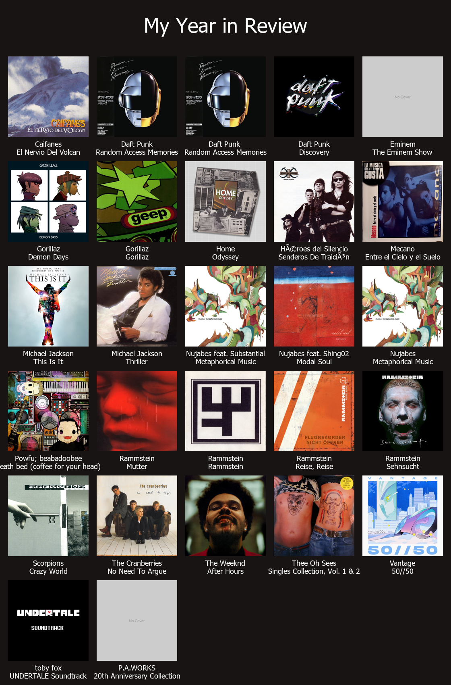

# Year in Review Album Art Generator


*Result from running the program.*

This project is specifically designed to create a personalized image collage of your music experience throughout the year.  
It uses album data exported from foobar2000's complement: `discord-rich-presence`.  
The script fetches album covers from the MusicBrainz database and falls back on placeholders if no cover art is found.

## Features

-   Integrates with JSON data originating from foobar2000's `discord-rich-presence` complement.
-   Fetches album covers using the MusicBrainz API.
-   Constructs a grid-style collage featuring album covers alongside artist names.
-   Uses a default placeholder image when artwork is unavailable.
-   Outputs the final collage as `year_in_review.png`.

## Development Standards and Tools

This project adheres to coding standards mandated by [flake8](https://flake8.pycqa.org/), ensuring code quality and consistency. In addition, it includes several development dependencies for enhanced functionality:

-   **Flake8**: Ensures compliance with PEP 8 style standards.
-   **Black**: Aims for consistent code formatting.
-   **Mypy**: Provides static type checking to ensure type correctness. (Not really enforced).
-   **types-requests**: Supplies type hints for the `requests` library to enhance static analysis.

These tools are included as **optional** development dependencies when you set up the project using Poetry.

## Project Setup

This project utilizes [Poetry](https://python-poetry.org/) for dependency management and packaging.

### Installation Steps

1. **Install Poetry**: If you haven't done so yet, install Poetry by following the instructions on their [official website](https://python-poetry.org/docs/#installation).

2. **Install Dependencies**: Navigate to the project root directory and run:

    For users:

    ```shell
    poetry install --without dev
    ```

    For developers:

    ```shell
    poetry install
    ```

    This installs all required and development dependencies.

3. **Activate Virtual Environment**:

    ```shell
    poetry shell
    ```

    This creates and activates a virtual environment with both runtime and development dependencies.

## How It Works

1. **Load Album Data**: Reads album information from a JSON file generated by the `discord-rich-presence` complement used in foobar2000 (must be installed manually beforehand).

2. **Fetch Images**:

    - Attempts to load the covers provided in the JSON as URLs.
    - Queries MusicBrainz for album covers based on artist and album titles **if** the URL is `null`.
    - Defaults to a placeholder image if no cover art is found after a set number of retries.

3. **Create Image Collage**:
    - Produces an image with a grid layout of album covers. The amount of columns is customizable.
    - Displays album and artist names beneath each cover.
    - Saves the collage as `year_in_review.png`.

## Usage

1. Ensure your `album.json` file (generated by `discord-rich-presence`) is structured correctly, similar to:

    ```json
    {
        "Artist1|Album1": "CoverURL1",
        "Artist2|Album2": "CoverURL2"
    }
    ```

    **Note**: This file is usually located in:  
    `%APPDATA%\foobar2000-v2\foo_discord_rich\images\art_urls.v2.0.1.json`  
    Rename it as `album.json` and place it in the directory.

2. Execute the script within the Poetry shell:

    ```shell
    python your_script.py
    ```

3. Wait for the collage to pop up or find the resulting collage as `year_in_review.png` in the directory.

## Customization

-   Adjust the `num_columns` variable within the `create_review_image` function to change the number of columns in the collage.
-   Font preferences default to `tahoma.ttf`, reverting to system default fonts if unavailable.

---

### TODO

-   Will be compatible with playback statistics in the future.
-   Support for MusicBee
